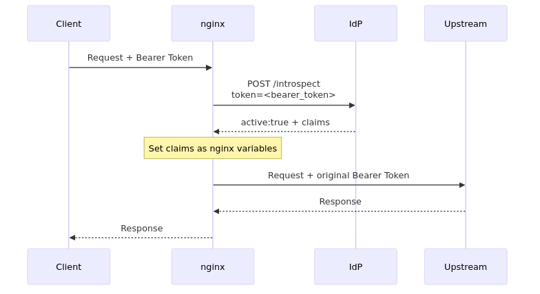
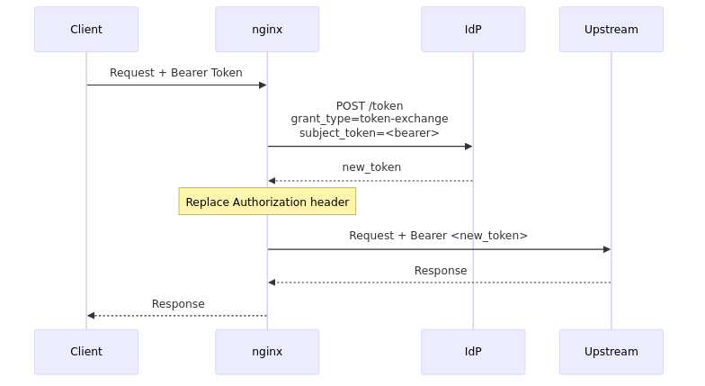
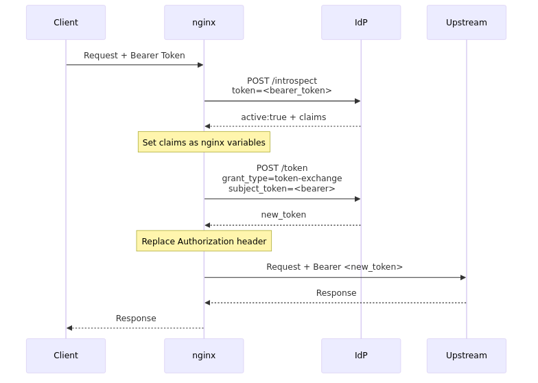

# nginx auth_oauth2_token module

An OAuth 2.0 token operations module for nginx.

## Overview

### About This Module

A module that performs token validation and exchange on nginx for the API Gateway pattern. By integrating with an IdP (Identity Provider), it provides the following OAuth 2.0 operations:

- **Token Introspection** ([RFC 7662](https://datatracker.ietf.org/doc/html/rfc7662)): Dynamically validates Bearer Tokens by querying the IdP
- **Token Exchange** ([RFC 8693](https://datatracker.ietf.org/doc/html/rfc8693)): Exchanges Bearer Tokens for new tokens with reduced scope and forwards them to downstream services

Introspection and Exchange can be enabled independently, providing three operating modes:

| Mode | Introspection | Exchange | Use Case |
|------|:---:|:---:|----------|
| Introspect only | o | - | When token validation alone is sufficient |
| Exchange only | - | o | When the IdP validates tokens during exchange |
| Introspect + Exchange | o | o | Full pipeline (validate then exchange) |

**License**: BSD-2-Clause

### Comparison with nginx-auth-jwt

| Module | Validation | Characteristics |
|--------|-----------|-----------------|
| **nginx-auth-jwt** | Static (JWT signature) | Performance-focused, no IdP dependency |
| **nginx-auth-oauth2-token** | Dynamic (IdP query) | Immediate revocation detection, scope reduction |

### Key Features

- Runs in the `ACCESS_PHASE` (validates/exchanges tokens before `proxy_pass`)
- Asynchronous HTTP communication with IdP via `ngx_http_subrequest()`
- Shared memory caching for Introspection/Exchange results (with TTL management)
- Exposes Introspection claims as nginx variables
- Automatically replaces the upstream `Authorization` header with the exchanged token
- Supports loading client secrets from files

### Security

See [SECURITY.md](docs/SECURITY.md) for security considerations.

- Client secrets can be loaded from files (avoids embedding in configuration)
- HTTP Basic authentication for IdP communication
- JSON response size limit (64KB)
- No negative cache (`active: false` responses are not cached)
- Cache configuration is required for production (prevents IdP overload)


## Quick Start

See [INSTALL.md](docs/INSTALL.md) for installation instructions.

### Minimal Configuration

#### Token Introspection Only

```nginx
http {
    auth_oauth2_token_client_id           "my-gateway";
    auth_oauth2_token_client_secret_file  /etc/nginx/secrets/client_secret;

    server {
        listen 443 ssl;

        # Proxy to IdP introspection endpoint
        location = /_introspect {
            internal;
            proxy_pass https://idp.example.com/oauth2/introspect;
        }

        location /api/ {
            auth_oauth2_token_introspect          on;
            auth_oauth2_token_introspect_endpoint /_introspect;

            proxy_set_header X-User-Sub $oauth2_token_sub;
            proxy_pass http://backend;
        }
    }
}
```

#### Token Exchange Only

When the IdP validates tokens during exchange, Introspection can be omitted.

```nginx
http {
    auth_oauth2_token_client_id           "my-gateway";
    auth_oauth2_token_client_secret_file  /etc/nginx/secrets/client_secret;

    server {
        listen 443 ssl;

        # Proxy to IdP token endpoint
        location = /_token {
            internal;
            proxy_pass https://idp.example.com/oauth2/token;
        }

        location /api/ {
            auth_oauth2_token_exchange            on;
            auth_oauth2_token_token_endpoint      /_token;
            auth_oauth2_token_audience            "backend-service";
            auth_oauth2_token_scope               "api:read";

            proxy_pass http://backend;
        }
    }
}
```

#### Introspection + Exchange (Full Pipeline)

```nginx
http {
    auth_oauth2_token_client_id           "my-gateway";
    auth_oauth2_token_client_secret_file  /etc/nginx/secrets/client_secret;

    server {
        listen 443 ssl;

        location = /_introspect {
            internal;
            proxy_pass https://idp.example.com/oauth2/introspect;
        }

        location = /_token {
            internal;
            proxy_pass https://idp.example.com/oauth2/token;
        }

        location /api/ {
            # Introspection
            auth_oauth2_token_introspect          on;
            auth_oauth2_token_introspect_endpoint /_introspect;
            auth_oauth2_token_introspect_cache    zone=introspect:10m max_ttl=60s;

            # Token Exchange
            auth_oauth2_token_exchange            on;
            auth_oauth2_token_token_endpoint      /_token;
            auth_oauth2_token_audience            "backend-service";
            auth_oauth2_token_scope               "api:read";
            auth_oauth2_token_exchange_cache      zone=exchange:10m max_ttl=300s;

            proxy_set_header X-User-Sub $oauth2_token_sub;
            proxy_pass http://backend;
        }
    }
}
```

> **Note**: `auth_oauth2_token_introspect_endpoint` and `auth_oauth2_token_token_endpoint` accept the URI of an `internal` location with `proxy_pass` to the IdP. The module automatically sets the POST request headers (`Content-Type`, `Authorization`) and body, so no additional configuration is needed on the internal location.

## Directives

See [DIRECTIVES.md](docs/DIRECTIVES.md) for details.

| Directive | Description | Context |
|---|---|---|
| [auth_oauth2_token_client_id](docs/DIRECTIVES.md#auth_oauth2_token_client_id) | Client ID | http |
| [auth_oauth2_token_client_secret](docs/DIRECTIVES.md#auth_oauth2_token_client_secret) | Client secret | http |
| [auth_oauth2_token_client_secret_file](docs/DIRECTIVES.md#auth_oauth2_token_client_secret_file) | Client secret file path | http |
| [auth_oauth2_token_introspect](docs/DIRECTIVES.md#auth_oauth2_token_introspect) | Enable/disable Introspection | http, server, location |
| [auth_oauth2_token_introspect_endpoint](docs/DIRECTIVES.md#auth_oauth2_token_introspect_endpoint) | Introspection endpoint URI | http, server, location |
| [auth_oauth2_token_introspect_cache](docs/DIRECTIVES.md#auth_oauth2_token_introspect_cache) | Introspection cache settings | http, server, location |
| [auth_oauth2_token_exchange](docs/DIRECTIVES.md#auth_oauth2_token_exchange) | Enable/disable Exchange | http, server, location |
| [auth_oauth2_token_token_endpoint](docs/DIRECTIVES.md#auth_oauth2_token_token_endpoint) | Token endpoint URI | http, server, location |
| [auth_oauth2_token_audience](docs/DIRECTIVES.md#auth_oauth2_token_audience) | Exchange target audience | http, server, location |
| [auth_oauth2_token_scope](docs/DIRECTIVES.md#auth_oauth2_token_scope) | Exchange requested scope | http, server, location |
| [auth_oauth2_token_exchange_cache](docs/DIRECTIVES.md#auth_oauth2_token_exchange_cache) | Exchange cache settings | http, server, location |


## Embedded Variables

See [DIRECTIVES.md](docs/DIRECTIVES.md#embedded-variables) for details.

| Variable | Description |
|---|---|
| `$oauth2_token_active` | Introspection result (`1` or `0`) |
| `$oauth2_token_sub` | Token subject |
| `$oauth2_token_scope` | Token scopes (space-separated) |
| `$oauth2_token_client_id` | Client ID that issued the token |
| `$oauth2_token_exp` | Token expiration (UNIX timestamp) |
| `$oauth2_token_new_token` | Exchanged new token |
| `$oauth2_token_new_token_type` | New token type |


## Appendix

### Request Processing Flow

#### Introspection Only



#### Token Exchange Only



#### Introspection + Exchange (Full Pipeline)



### Standards Reference

This module conforms to the following standards:

- **[RFC 7662 - OAuth 2.0 Token Introspection](https://datatracker.ietf.org/doc/html/rfc7662)**: Dynamic validation of Bearer Tokens
- **[RFC 8693 - OAuth 2.0 Token Exchange](https://datatracker.ietf.org/doc/html/rfc8693)**: Exchange tokens for scope-reduced tokens


## Related Documentation

**Configuration & Operations**:

- [INSTALL.md](docs/INSTALL.md): Installation guide
- [DIRECTIVES.md](docs/DIRECTIVES.md): Directives and variables reference
- [SECURITY.md](docs/SECURITY.md): Security considerations (cache settings, secret management)
